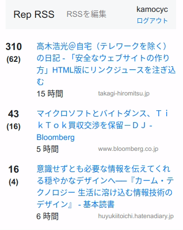

# Rep RSS

Twitterとはてなブックマークで話題の順に記事とコメントを表示するRSSリーダ

[Hacker News](https://news.ycombinator.com/)に似たUIを目指して作りました。

* Repository: https://github.com/kamocyc/rep-rss
* Hosted at: https://ancient-shelf-27599.herokuapp.com/
* 仕様: https://github.com/kamocyc/rep-rss/wiki

  

## 主な機能

* RSS中の記事のURLをTwitterで検索し、URLが含まれるツイート数を取得
* ツイート数と記事の公開時間を考慮してソート
* Twitterからコメントを取得して一覧表示
* はてなブックマークからも同様に件数とコメントを取得して表示

## 注意点

* Twitter APIの制限によく引っかかります。15分経つと解消されます。

## 技術など

言語は主にTypeScriptを使用。Expressの使い方はN予備校の資料を参考にした。

* バックエンド: Express, sequelize.js
* フロントエンド: React
